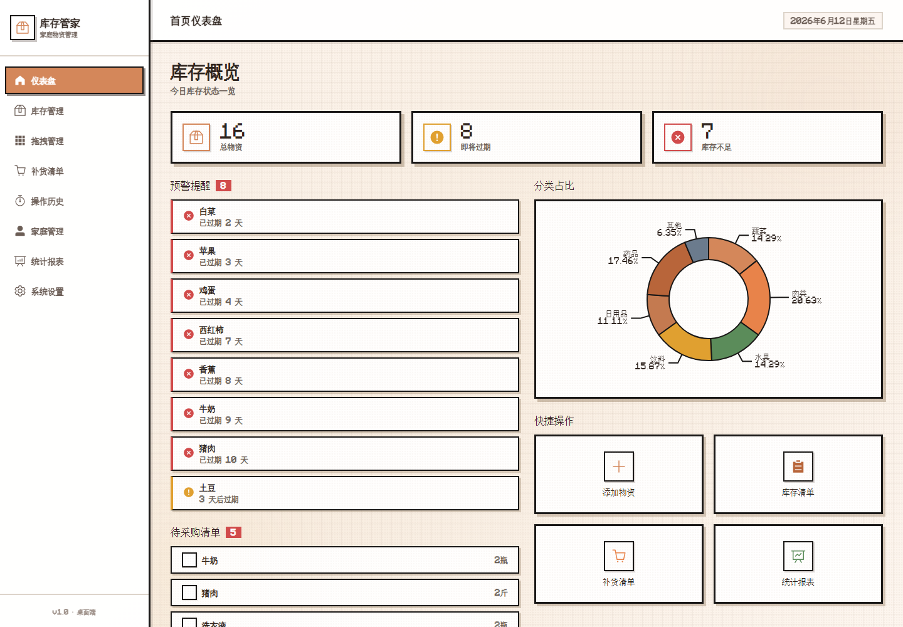
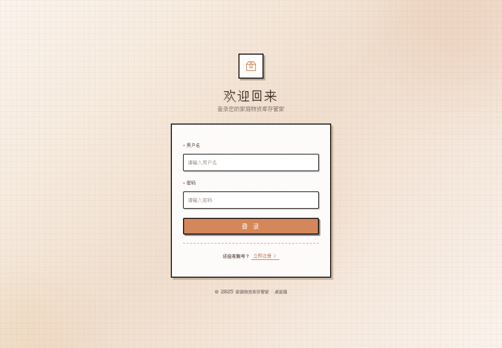
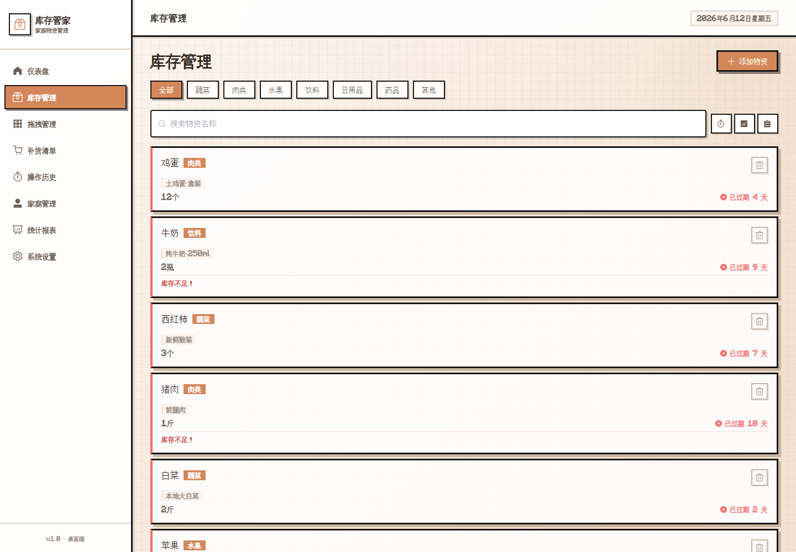
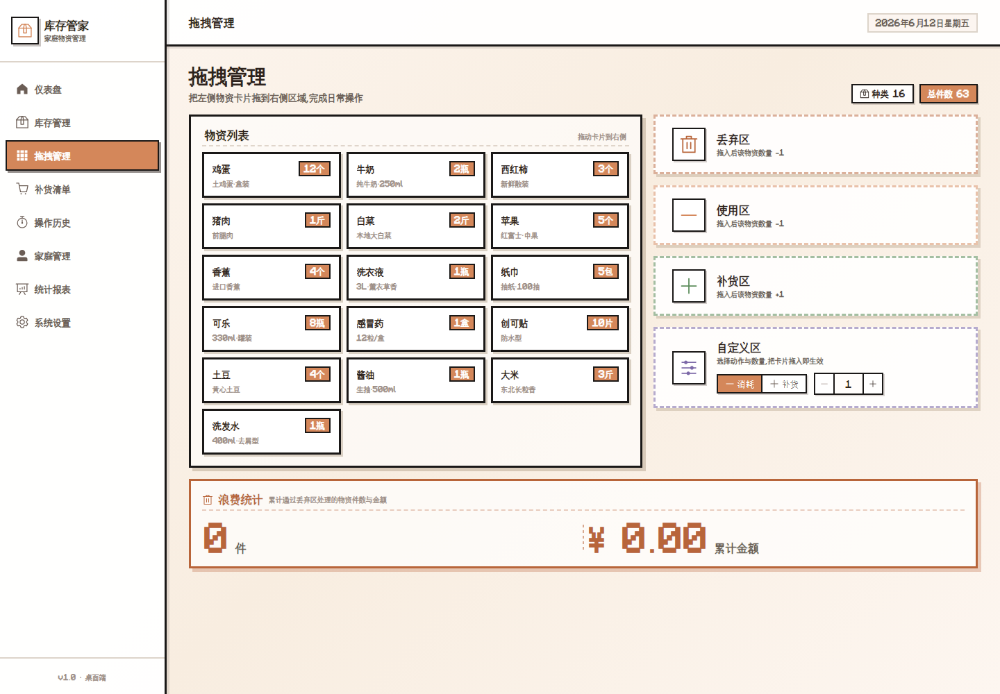
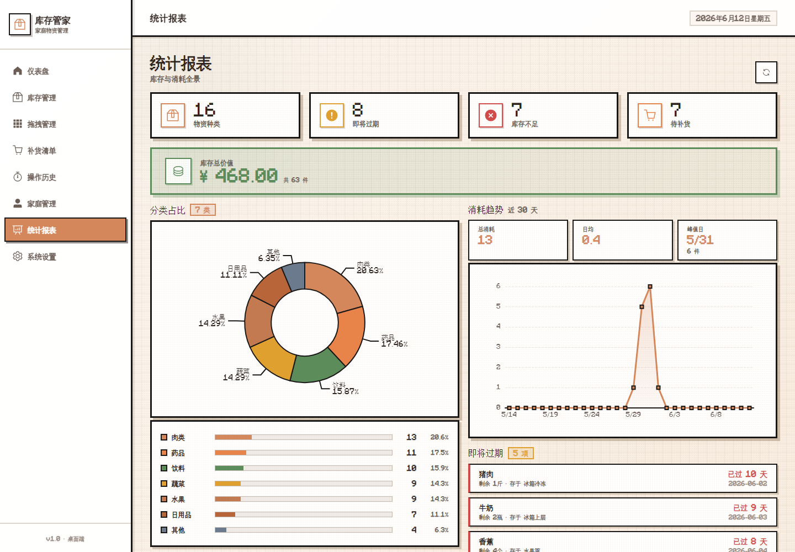

# 家庭物资库存管家

一个基于 Vue 3 的家庭物资库存管理系统，面向家庭日常物资的库存记录、过期提醒、补货清单、家庭协作和数据统计场景。项目采用像素风视觉语言，结合本地数据持久化与 Mock 接口，完整模拟前端库存管理应用的核心流程。



## 项目亮点

- 像素风 UI：统一字体、边框、卡片、色彩和交互反馈，形成稳定的视觉识别。
- 库存闭环：覆盖物资新增、查询、分类筛选、详情查看、编辑、删除和消耗记录。
- 家庭协作：支持账号注册登录、家庭创建、成员加入和家庭级库存数据共享。
- 智能提醒：根据保质期和最低库存阈值生成过期预警、库存不足提醒和补货清单。
- 数据看板：通过仪表盘和统计报表展示分类占比、库存状态、消耗趋势等信息。
- 工程规范：按功能分支开发，使用中文 Conventional Commits 记录协作过程。

## 技术栈

- 框架：Vue 3、Vite
- 状态管理：Pinia
- 路由：Vue Router
- UI 组件：Element Plus、Element Plus Icons
- 数据可视化：ECharts
- 请求与模拟：Axios、Mock.js
- 数据存储：localStorage、sessionStorage

## 功能模块

- 登录注册：账号注册、登录校验、登录态管理、路由权限守卫。
- 首页仪表盘：库存总览、过期预警、分类占比、快捷入口、待采购清单。
- 库存管理：物资列表、分类筛选、关键词搜索、库存状态标识、增删改查。
- 拖拽管理：通过拖拽方式调整物资分类和管理顺序，提升库存整理效率。
- 补货清单：自动汇总库存不足物资，支持采购状态管理。
- 家庭管理：创建家庭、邀请成员、共享家庭库存数据。
- 统计报表：分类占比、库存分布、消耗数据和趋势分析。
- 操作历史：记录新增、编辑、删除、消耗等关键操作。
- 系统设置：分类管理、阈值配置、数据导入导出。

## 项目截图

### 登录页面



### 库存管理



### 拖拽管理



### 统计报表



## 快速开始

```bash
npm install
npm run dev
```

开发服务器默认运行在 `http://localhost:3000`。

## 构建项目

```bash
npm run build
npm run preview
```

## 使用说明

- 首次进入系统时，请先注册账号再登录。
- 登录后可直接体验默认物资数据，也可以新增自己的家庭库存。
- 创建家庭后，可将其他已注册账号加入家庭，共享同一份库存数据。
- 所有演示数据保存在浏览器本地存储中，刷新页面后仍会保留。

## 协作分工

- YuanchuQ：主题风格、应用布局、登录注册、拖拽管理、家庭管理、统计报表、系统设置。
- folishdoc：数据服务、Mock 接口、状态管理、首页仪表盘、库存管理、补货清单、操作历史。

## Git 规范

- `main` 分支保留稳定版本。
- 每个页面或功能独立创建 `feature/*` 分支。
- 功能完成后通过 merge commit 合并，保留真实协作轨迹。
- 提交信息采用中文 Conventional Commits，例如 `feat: 完成库存列表页面`、`style: 定义全局主题样式`、`chore: 合并库存管理`。

## 项目结构

```text
src
├── api          # 接口封装
├── assets       # 字体与全局样式
├── components   # 通用组件
├── data         # 默认演示数据
├── mock         # Mock 接口
├── router       # 路由与权限守卫
├── stores       # Pinia 状态管理
├── utils        # 本地存储与业务工具
└── views        # 页面模块
```
